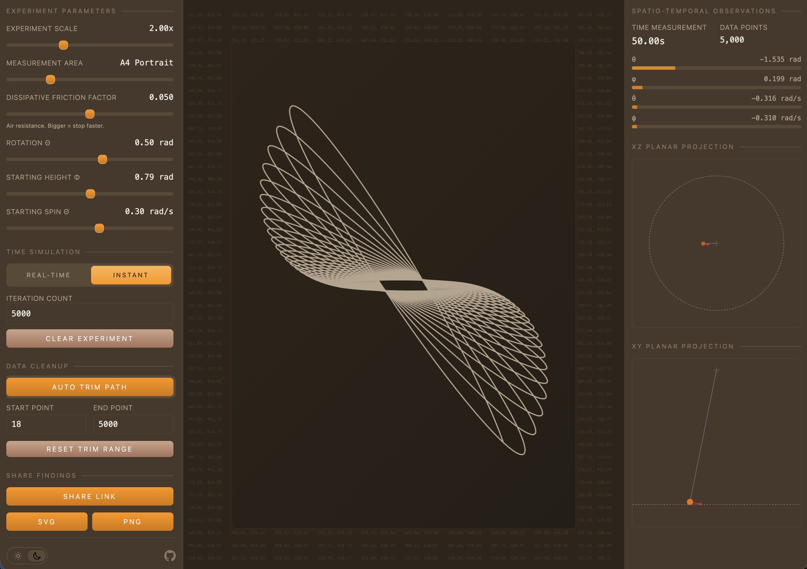

# Pendulum Plotter

A fun(?) tool for creating abstract art from pendulum movements.

[](https://app.netlify.com/projects/pendulumplotter/deploys)



**[Try it live →](https://plotter.haila.fi)**

## What is this?

Imagine a paint bucket swinging freely on a rope in 3D space, continuously dripping paint onto a canvas below. The result? Mesmerizing patterns created by the physics of a spherical pendulum.

No installation required—runs entirely in your browser!

## Features

- **Real-time simulation** — Watch the pendulum swing and paint trail form live
- **Instant mode** — Generate thousands of points immediately
- **Auto-trim** — Automatically find clean start and end points for closed loops
- **Multiple canvas formats** — A4, square, 16:9 in portrait or landscape
- **Export options** — Download as SVG or PNG for printing or further editing
- **Shareable links** — Share your creations with a URL

## Who is this for?

Artists, non-artists, and anyone else fascinated by smooth lines on a canvas.

## Getting Started

### Use it online

Visit **[plotter.haila.fi](https://plotter.haila.fi)** and start experimenting!

### Run locally

```bash
# Clone the repository
git clone https://github.com/MrHaila/pendulum-plotter.git
cd pendulum-plotter

# Install dependencies
pnpm install

# Start development server
pnpm dev
```

Then open [http://localhost:5173](http://localhost:5173) in your browser.

## Tech Stack

- [Vue 3](https://vuejs.org/) as the UI framework
- [Tailwind CSS v4](https://tailwindcss.com/) for styling
- [TypeScript](https://www.typescriptlang.org/) because I'm not a barbarian
- [Vite](https://vitejs.dev/) for development tooling

## Contributing

Pull requests welcome - if unlikely.

## License

[MIT](LICENSE)
